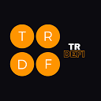
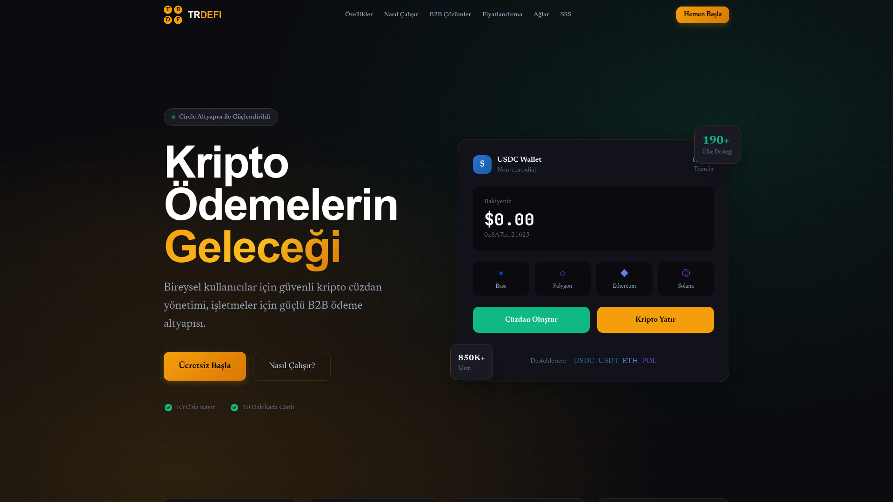

  

<h3 align="center">TRDEFI — crypto payment infrastructure</h3>

  <b>Secure crypto wallet management for individuals, and payment infrastructure for businesses.</b> 
  Non-custodial by default, live in about ten minutes, and no KYC to open an account.

  

---

## What it is

TRDEFI gives people and businesses a way to hold, receive and move stablecoins without handing
custody to anyone:

* **For individuals** — a self-custody wallet with fiat on-ramp, built on passkeys rather than seed
  phrases. No KYC to create the account; the payment provider applies its own identity checks when
  buying crypto with fiat.
* **For businesses** — payment links, automatic settlement to the merchant's own wallet, and
  multi-chain acceptance without running infrastructure.

## Coverage

| | |
|---|---|
| Account opening | No KYC/KYB required |
| Time to go live | About 10 minutes |
| Reach | 190+ countries |
| Implementation | No technical knowledge needed — guided setup |

Buying crypto with fiat is performed by our payment partner, which applies its own legal KYC
process at that step. Holding, receiving and sending stablecoins does not require it.

## Supported networks

Ethereum · Base · Polygon · Tron · Bitcoin — with Solana on the roadmap.

All networks are actively exercised on testnet before they are offered.

## How it works

1. **Create an account** with an email address.
2. **Create a wallet** — a passkey (biometric) protected account. The private key never leaves the
   device.
3. **Fund it** with a bank transfer, card, or by sending stablecoins from an existing wallet.
4. **Receive and send** — payment links for businesses, direct transfers for individuals.

## Custody model

| Property | Value |
|---|---|
| Key custody | The user's device (passkey) |
| TRDEFI access to keys | None |
| Account recovery | Backup recovery phrase, chosen by the user |
| Business settlement | Direct to the merchant's own wallet |
| Wallet type | Smart account, one address across EVM networks |

## Live infrastructure

The liquidity engine behind the maker product runs in public. Its metrics update continuously:

| Metric | Live value |
|---|---|
| 30-day settled volume |  |
| Open strategies |  |
| Networks |  |

## Screenshots

## Changelog

### 2026-09 — Wallet migration, multilingual site, language routing

* **Passkey wallets** replace the previous wallet provider: biometric sign-in, one address across
  EVM networks, and an optional recovery phrase registered at setup.
* Fiat on-ramp moved to **Circle**, with bank transfer across supported countries and a clear
  fallback to card where bank transfer is unavailable.
* Account flow reworked so a wallet can be created before any deposit is made.
* Site published in **six languages** (English, German, Japanese, French, Spanish, Portuguese), each
  a real static page with `hreflang` — no runtime translation proxy.
* Content pass: removed every reference to former payment providers and corrected earlier
  over-claims about identity checks.
* Security pass: read-only public data, hardened server endpoints, and no credentials in any
  client bundle.

### 2026-08 — Business payments

* Payment links, automatic settlement and multi-chain acceptance for merchants.
* Consolidated wallet view with balance and transaction history.

## License

All rights reserved. This repository and its contents are the property of TRDEFI Ltd. No license
is granted for reuse, redistribution or derivative works.

## Links

* **Company** — https://trdefi.com
* **Institutional** — https://yield.trdefi.com
* **Maker app** — https://app.trdefi.com
* **Statistics** — https://yield.trdefi.com/stats.html
